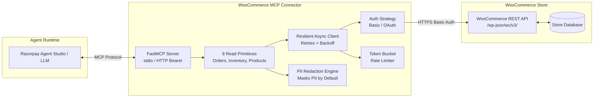

# WooCommerce Connector for Razorpay Agent Studio

A private, read-only Model Context Protocol (MCP) connector enabling Razorpay Agent Studio agents to securely query WooCommerce orders, inventory, and catalog items with built-in PII redaction and rate-limit resilience.

---

## Architecture Overview



---

## Quickstart (Under 10 Commands)

Get up and running from a fresh clone in less than 2 minutes:

```bash
# 1. Clone repository and navigate to root
git clone https://github.com/shubhampatil631/woo-agent-connector.git
cd woo-agent-connector

# 2. Create and activate virtual environment
python -m venv .venv
source .venv/bin/activate  # On Windows: .venv\Scripts\activate

# 3. Install connector and dev dependencies
pip install -e ".[dev]"

# 4. Run instant zero-dependency interactive demo (100% in-process mock)
python scripts/demo.py --mock

# 5. Run full test suite with 90% coverage
pytest -v --cov=src/woo_connector

# 6. (Optional) Start local WooCommerce Docker sandbox
docker compose up -d

# 7. (Optional) Seed sandbox catalog (~40 products, ~120 orders)
python scripts/seed.py

# 8. Start FastMCP server in stdio mode
woo-mcp
```

---

## Environment Variables

All secrets and runtime configuration are managed via environment variables. Commit only `.env.example`.

| Variable | Required | Default | Description |
| :--- | :---: | :---: | :--- |
| `WOO_BASE_URL` | **Yes** | `http://localhost:8080` | Base URL of the WooCommerce WordPress store |
| `WOO_CONSUMER_KEY` | **Yes** | — | WooCommerce REST API Consumer Key (`ck_...`) |
| `WOO_CONSUMER_SECRET` | **Yes** | — | WooCommerce REST API Consumer Secret (`cs_...`) |
| `WOO_AUTH_TYPE` | No | `api_key` | Authentication mode: `api_key` or `oauth` |
| `PII_MODE` | No | `redacted` | `redacted` (masks email/phone/address) or `full` |
| `MAX_PAGE_SIZE` | No | `50` | Maximum items returned per pagination request (capped at 100) |
| `RATE_LIMIT_RPS` | No | `5.0` | Client-side token bucket rate limit (requests/sec) |
| `REQUEST_TIMEOUT` | No | `10.0` | Upstream HTTP request timeout in seconds |
| `MAX_RETRIES` | No | `3` | Maximum retry attempts for 429/502/503/504 errors |
| `CONNECTOR_API_KEY` | No | — | Bearer token securing HTTP/SSE transport endpoint |
| `STRICT_READONLY` | No | `false` | When true, rejects startup if API key has write permissions |

---

## Connecting to Razorpay Agent Studio

### Option 1: Local `stdio` Transport (Recommended for local / CLI agents)

Configure your Agent Studio or MCP client config (e.g., `examples/agent_studio_config.json`):

```json
{
  "mcpServers": {
    "woocommerce": {
      "command": "python",
      "args": ["-m", "woo_connector.server", "--transport", "stdio"],
      "env": {
        "WOO_BASE_URL": "https://store.example.com",
        "WOO_CONSUMER_KEY": "ck_live_merchant_key",
        "WOO_CONSUMER_SECRET": "cs_live_merchant_secret",
        "PII_MODE": "redacted"
      }
    }
  }
}
```

### Option 2: Streamable HTTP/SSE Transport (Remote deployment)

Start the connector as an authenticated HTTP microservice:

```bash
CONNECTOR_API_KEY="secret-bearer-token" woo-mcp --transport http --port 8000
```

Configure Agent Studio with Bearer Authentication:

```json
{
  "mcpServers": {
    "woocommerce-http": {
      "url": "http://connector-host:8000/sse",
      "headers": {
        "Authorization": "Bearer secret-bearer-token"
      }
    }
  }
}
```

---

## Running Verification & Tests

```bash
# Run unit & integration tests with coverage report (target >= 85%, achieved: 90%)
pytest -v --cov=src/woo_connector --cov-report=term-missing

# Run code style and linter checks
ruff check .

# Export machine-readable MCP tool specification (never drifts from code)
python scripts/export_spec.py

# Run canned LLM tool-calling loop demo
python scripts/agent_demo.py
```

---

## Repository Structure

```text
woo-agent-connector/
├── src/woo_connector/           # Core connector package
│   ├── config.py                # Pydantic v2 settings & secret masking
│   ├── auth.py                  # API Key & OAuth strategies + validation
│   ├── client.py                # Resilient async client + token bucket limiter
│   ├── redact.py                # Privacy-safe PII sanitization engine
│   ├── models.py                # Compact, agent-friendly domain models
│   ├── tools.py                 # 9 transport-agnostic read primitives
│   └── server.py                # FastMCP server + stdio/HTTP transports
├── tests/                       # Automated test suite (69 tests, 90% coverage)
│   ├── test_auth.py             # Auth flows & credential checks
│   ├── test_client.py           # Rate limiting & exponential backoff
│   ├── test_config.py           # Settings validation & secret masking
│   ├── test_redact.py           # PII redaction rules
│   ├── test_tools.py            # Read primitives & error mapping
│   ├── test_server.py           # MCP server & Bearer auth middleware
│   ├── test_e2e_mcp.py          # End-to-end MCP tool invocations
│   └── mock_woo.py              # In-process mock WooCommerce simulator
├── docs/                        # Architecture & compliance documentation
│   ├── CAPABILITIES.md          # What the agent can and cannot do
│   ├── DESIGN.md                # Tradeoffs & Merchant Discovery Guide
│   ├── LIMITATIONS.md           # Production gaps & future roadmap
│   ├── IMPACT.md                # Business KPI measurement plan
│   └── mcp-tools.json           # Machine-readable MCP tool spec
├── scripts/                     # Operational & demonstration scripts
│   ├── authorize_app.py         # WooCommerce OAuth callback helper
│   ├── export_spec.py           # Tool spec generator
│   ├── demo.py                  # Interactive formatted CLI demo
│   ├── agent_demo.py            # LLM tool-calling agent runner
│   └── seed.py                  # Realistic sandbox data seeder
├── docker/                      # WordPress + WooCommerce local environment
│   └── docker-compose.yml       # MariaDB, WordPress, WP-CLI automation
├── examples/                    # Agent Studio integration templates
│   └── agent_studio_config.json # stdio & HTTP connection examples
├── Makefile                     # Standard developer commands
├── pyproject.toml               # Package dependencies & tool configs
└── README.md
```
