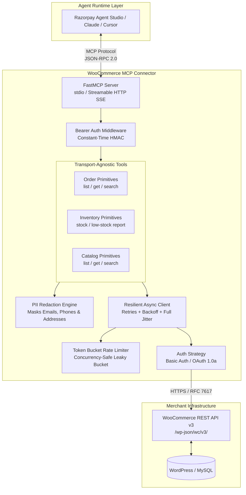

# WooCommerce Connector for Razorpay Agent Studio

[](https://www.python.org/downloads/)
[](https://modelcontextprotocol.io/)
[](https://pytest.org)
[](https://github.com/astral-sh/ruff)
[](https://mypy.readthedocs.io/)
[](https://opensource.org/licenses/MIT)

A production-grade, private Model Context Protocol (MCP) connector that enables **Razorpay Agent Studio** agents to query WooCommerce orders, inventory, and catalog items safely. Built specifically for automated merchant support (WISMO — "Where is my order?"), stock triage, and customer assistance with **strictly read-only enforcement**, **connector-level PII redaction**, and **jittered rate-limit resilience**.

---

## 🏛️ System Architecture



---

## 🛠️ 9 MCP Tools Reference

The connector registers 9 transport-agnostic read primitives with schemas introspected in [docs/mcp-tools.json](docs/mcp-tools.json):

| Tool Name | Parameters | Returns | Description & Primary Agent Use Case |
| :--- | :--- | :--- | :--- |
| `list_orders` | `status`, `customer_id`, `after`, `before`, `page`, `per_page` | `Page[OrderSummary]` | List store orders with status & date filters (e.g., finding failed or processing orders). |
| `get_order` | `order_id` | `OrderDetail` | Get comprehensive order details (line items, SKU totals, delivery status, masked PII). |
| `search_orders` | `query`, `page`, `per_page` | `Page[OrderSummary]` | Search orders by order number, customer name, email, or address keywords. |
| `list_products` | `status`, `stock_status`, `page`, `per_page` | `Page[ProductSummary]` | Browse the store catalog with stock availability and publication status filters. |
| `get_product` | `product_id` | `ProductSummary` | Lookup product pricing, SKU, variants, and stock configuration for a specific item. |
| `search_products` | `query`, `sku`, `page`, `per_page` | `Page[ProductSummary]` | Search catalog by text query (name/description) or exact SKU. |
| `get_stock` | `product_id_or_sku` | `StockInfo` | Instant stock check for a specific product ID or SKU with low-stock alert flag. |
| `list_low_stock` | `threshold`, `page`, `per_page` | `Page[StockInfo]` | Generate actionable low-stock and out-of-stock inventory replenishment reports. |
| `get_store_status` | *None* | `StoreStatus` | Verify store health, WooCommerce/WordPress versions, base currency, and timezone. |

### MCP Resources:
- `woo://store/status`: Real-time system health and store telemetry.
- `woo://docs/capabilities`: Serves [docs/CAPABILITIES.md](docs/CAPABILITIES.md) for dynamic LLM self-discovery.

---

## 🔒 Key Engineering & Security Highlights

1. **Strict Read-Only Guarantee**:
   - Zero mutation or write tools are registered.
   - The underlying `WooClient` **hard-rejects any non-`GET` HTTP methods** (`POST`, `PUT`, `DELETE`, `PATCH`) at the network layer.
   - Supports `STRICT_READONLY=true` to verify key permissions on startup.
2. **Connector-Level PII Redaction**:
   - Privacy-safe by default (`PII_MODE=redacted`).
   - Customer emails are masked (`j***@example.com`), phone numbers keep only last digits (`***-***-**67`), and addresses are truncated to city/state/country. Customer names are converted to `First Name + Initial` (e.g., `Jane D.`).
3. **Concurrency-Safe Token Bucket Limiter**:
   - Shared client-side token bucket (`RATE_LIMIT_RPS=5.0`) smooths bursty LLM queries, protecting shared WordPress hosting from 429 penalties.
4. **Jittered Exponential Backoff**:
   - Automatically intercepts and retries `429 Too Many Requests` (respecting `Retry-After` headers) and upstream `502`, `503`, `504` errors.
5. **Dual MCP Transports**:
   - **`stdio`**: Zero-overhead IPC for local LLM tools (Claude Desktop, Cursor, Agent Studio CLI).
   - **Streamable HTTP (SSE)**: Authenticated microservice mode with constant-time Bearer token verification (`CONNECTOR_API_KEY`).

---

## ⚡ Quickstart (< 2 Minutes)

Get up and running from a fresh clone with zero external dependencies:

```bash
# 1. Clone repository and enter directory
git clone https://github.com/shubhampatil631/woo-agent-connector.git
cd woo-agent-connector

# 2. Create and activate virtual environment (Python 3.11+)
python -m venv .venv
source .venv/bin/activate  # On Windows: .venv\Scripts\activate

# 3. Install connector and dev dependencies
pip install -e ".[dev]"

# 4. Copy environment template (works out-of-the-box with mock server)
cp .env.example .env

# 5. Run instant zero-dependency interactive verification demo
python scripts/demo.py --mock

# 6. Run autonomous LLM tool-calling agent simulation
python scripts/agent_demo.py --mock

# 7. Run test suite with coverage report (72 tests, 90% coverage)
pytest -v --cov=src/woo_connector

# 8. Start production FastMCP server (stdio transport)
woo-mcp
```

---

## 📺 Live Verification Output

Running `python scripts/demo.py --mock` executes all 7 core verification scenarios in-process:

```text
================================================================================
           WooCommerce MCP Connector: End-to-End Verification Demo
================================================================================

[STEP 1] Store Credential & Connectivity Check
  ✓ Authenticated with WooCommerce v8.9.1 (Store: Mock WooCommerce Store)
  ✓ Base Currency: INR | Timezone: Asia/Kolkata

[STEP 2] Query Recent Orders (Redacted PII)
  ┌──────┬─────────┬────────────┬────────────┬───────┬──────────────┐
  │ ID   │ Order # │ Status     │ Total      │ Items │ Customer Ref │
  ├──────┼─────────┼────────────┼────────────┼───────┼──────────────┤
  │ 1001 │ 1001    │ processing │ INR 99.98  │     2 │ Customer #2  │
  │ 1002 │ 1002    │ completed  │ INR 149.97 │     1 │ Customer #3  │
  └──────┴─────────┴────────────┴────────────┴───────┴──────────────┘

[STEP 3] Order Detail with PII Masking Verification
  • Customer Name: Jane D.
  • Customer Email: c***@example.com (Redacted)
  • Customer Phone: ***-***-**01 (Redacted)
  • Shipping Address: Bengaluru, IN (City/Country only)

[STEP 4] Inventory Low-Stock Report
  • Product #101 (SLEEVE-LTH-01): Qty = 4 [LOW STOCK ALERT]
  • Product #103 (MOUSE-WL-BLK): Qty = 0 [OUT OF STOCK]

[STEP 5] Forced Upstream 429 Rate-Limit Recovery
  • Attempt 1: HTTP 429 -> Intercepted Retry-After: 0.50s backoff...
  • Attempt 2: HTTP 200 OK -> Successfully recovered without crashing agent!

[STEP 6] Prohibited Write Rejection
  • POST /wp-json/wc/v3/orders -> ValidationError: Prohibited non-GET write request.

================================================================================
 ALL VERIFICATION SCENARIOS COMPLETED SUCCESSFULLY!
================================================================================
```

---

## ⚙️ Environment Configuration

All secrets and runtime configuration are managed via environment variables. Commit only `.env.example`.

| Variable | Required | Default | Description |
| :--- | :---: | :---: | :--- |
| `WOO_BASE_URL` | **Yes** | `http://localhost:8080` | Base URL of the WooCommerce WordPress store |
| `WOO_CONSUMER_KEY` | **Yes** | — | WooCommerce REST API Consumer Key (`ck_...`) |
| `WOO_CONSUMER_SECRET` | **Yes** | — | WooCommerce REST API Consumer Secret (`cs_...`) |
| `WOO_AUTH_TYPE` | No | `api_key` | Authentication mode: `api_key` or `oauth` |
| `PII_MODE` | No | `redacted` | `redacted` (masks email/phone/address) or `full` |
| `MAX_PAGE_SIZE` | No | `50` | Maximum items returned per pagination request (capped at 100) |
| `RATE_LIMIT_RPS` | No | `5.0` | Client-side token bucket rate limit (requests/sec) |
| `REQUEST_TIMEOUT` | No | `10.0` | Upstream HTTP request timeout in seconds |
| `MAX_RETRIES` | No | `3` | Maximum retry attempts for 429/502/503/504 errors |
| `CONNECTOR_API_KEY` | No | — | Bearer token securing HTTP/SSE transport endpoint |
| `STRICT_READONLY` | No | `false` | When true, rejects startup if API key has write permissions |

---

## 🔌 Connecting to Razorpay Agent Studio

### Option 1: Local `stdio` Transport

Configure your Agent Studio or MCP client config (e.g., `examples/agent_studio_config.json`):

```json
{
  "mcpServers": {
    "woocommerce": {
      "command": "python",
      "args": ["-m", "woo_connector.server", "--transport", "stdio"],
      "env": {
        "WOO_BASE_URL": "https://store.example.com",
        "WOO_CONSUMER_KEY": "ck_live_merchant_key",
        "WOO_CONSUMER_SECRET": "cs_live_merchant_secret",
        "PII_MODE": "redacted"
      }
    }
  }
}
```

### Option 2: Streamable HTTP/SSE Transport

Launch the server with Bearer token authentication:

```bash
CONNECTOR_API_KEY="secret-bearer-token" woo-mcp --transport http --port 8000
```

Configure Agent Studio with HTTP Headers:

```json
{
  "mcpServers": {
    "woocommerce-http": {
      "url": "http://connector-host:8000/sse",
      "headers": {
        "Authorization": "Bearer secret-bearer-token"
      }
    }
  }
}
```

---

## 🧪 Testing & Code Quality

The connector is backed by a comprehensive automated test suite with **90% code coverage**:

```bash
# Run all 72 unit, integration, and E2E tests
pytest -v --cov=src/woo_connector --cov-report=term-missing

# Run Ruff style & linting checks
ruff check .

# Run MyPy static type checks
mypy src/woo_connector

# Regenerate machine-readable MCP tool specification
python scripts/export_spec.py
```

### Test Suite Breakdown:
| Test Module | Coverage | Tests | Scope |
| :--- | :---: | :---: | :--- |
| `test_auth.py` | 94% | 11 | Basic Auth, OAuth 1.0a signatures, credential validation. |
| `test_client.py` | 80% | 14 | Token bucket math, 429/503 retry jitter, non-GET rejection, log sanitization. |
| `test_config.py` | 95% | 8 | Pydantic v2 settings, aliases, secret masking in `__repr__`. |
| `test_redact.py` | 96% | 8 | Email, phone number, name, and address masking algorithms. |
| `test_tools.py` | 90% | 18 | All 9 read primitives, filter queries, pagination, error mapping. |
| `test_server.py` | 91% | 11 | FastMCP registration, resources, Bearer auth middleware, startup checks. |
| `test_e2e_mcp.py` | 100% | 6 | In-process MCP client tool calls, pagination over 3 pages, auth failure. |
| **Total** | **90%** | **72** | **Full end-to-end connector verification** |

---

## 📊 Merchant Impact & Business KPIs

| Metric | Manual Baseline | Target with Connector | Measurement Method |
| :--- | :--- | :--- | :--- |
| **Order Status Lookup (WISMO)** | 90–180 seconds | **< 2.5 seconds** | Tool execution latency telemetry |
| **Inventory Verification** | 60–120 seconds | **< 1.0 second** | Direct SKU lookup via `get_stock` |
| **Tier-1 Ticket Deflection** | 0% | **40% – 60%** | Ticketing resolution tagging (Freshdesk/Zendesk) |
| **Connector Reliability** | N/A | **> 99.9%** | Ratio of 2xx responses to total queries |
| **LLM Token Efficiency** | ~2,500 tokens/order | **~350 tokens** | Response model normalization |

---

## 🧭 Forward-Deployed Engineer: Discovery Guide

Before deploying this connector to a live merchant, an FDE conducts a 5-point discovery:
1. **Workflow & Persona**: Is the agent powering external customer chat or internal support agents?
2. **Data Privacy**: Which team members have visibility into masked vs. unmasked customer data?
3. **Traffic & Peak Load**: What are the merchant's flash sale peak QPS and upstream hosting tier?
4. **Custom Plugins**: Are there shipping plugins (Shiprocket, Delhivery) adding custom tracking meta?
5. **Success Definition**: What is the target deflection rate and rollback SLA?

---

## 📂 Repository Structure

```text
woo-agent-connector/
├── src/woo_connector/           # Core connector package
│   ├── config.py                # Pydantic v2 settings & secret masking
│   ├── auth.py                  # API Key & OAuth strategies + validation
│   ├── client.py                # Resilient async client + token bucket limiter
│   ├── redact.py                # Privacy-safe PII sanitization engine
│   ├── models.py                # Compact, agent-friendly domain models
│   ├── tools.py                 # 9 transport-agnostic read primitives
│   └── server.py                # FastMCP server + stdio/HTTP transports
├── tests/                       # Automated test suite (72 tests, 90% coverage)
│   ├── test_auth.py             # Auth flows & credential checks
│   ├── test_client.py           # Rate limiting & exponential backoff
│   ├── test_config.py           # Settings validation & secret masking
│   ├── test_redact.py           # PII redaction rules
│   ├── test_tools.py            # Read primitives & error mapping
│   ├── test_server.py           # MCP server & Bearer auth middleware
│   ├── test_e2e_mcp.py          # End-to-end MCP tool invocations
│   └── mock_woo.py              # In-process mock WooCommerce simulator
├── docs/                        # Comprehensive documentation suite
│   ├── CAPABILITIES.md          # What the agent can and cannot do
│   ├── DESIGN.md                # Tradeoffs & Merchant Discovery Guide
│   ├── LIMITATIONS.md           # Production gaps & future roadmap
│   ├── IMPACT.md                # Business KPI measurement plan
│   └── mcp-tools.json           # Machine-readable MCP tool spec
├── scripts/                     # Operational & demonstration scripts
│   ├── demo.py                  # Zero-dependency rich CLI verification demo
│   ├── agent_demo.py            # LLM tool-calling agent simulation
│   ├── export_spec.py           # Tool spec generator
│   ├── authorize_app.py         # WooCommerce OAuth callback helper
│   └── seed.py                  # Realistic sandbox data seeder
├── docker/                      # WordPress + WooCommerce local environment
│   └── docker-compose.yml       # MariaDB, WordPress, WP-CLI automation
├── examples/                    # Agent Studio integration templates
│   └── agent_studio_config.json # stdio & HTTP connection examples
├── pyproject.toml               # Package dependencies & tool configs
├── SUBMISSION.md                # Razorpay submission summary
└── README.md                    # Project overview & quickstart
```

---

## 📚 Complete Documentation Links

- [SUBMISSION.md](SUBMISSION.md): Submission overview & setup summary.
- [docs/CAPABILITIES.md](docs/CAPABILITIES.md): Full capabilities, enforced boundaries, and safe query patterns.
- [docs/DESIGN.md](docs/DESIGN.md): Design decisions, architectural tradeoffs, and FDE Discovery Guide.
- [docs/LIMITATIONS.md](docs/LIMITATIONS.md): System limitations and enterprise roadmap (webhooks, Redis, KMS).
- [docs/IMPACT.md](docs/IMPACT.md): Quantitative merchant impact measurement plan.
- [docs/mcp-tools.json](docs/mcp-tools.json): Auto-generated machine-readable MCP tool specification.

---

## 👤 Author & Contact

**Shubham Patil**  
*Forward-Deployed Engineer Candidate | Agent Studio, Razorpay*

- **LinkedIn**: [linkedin.com/in/shubham-patil-03019a283](https://www.linkedin.com/in/shubham-patil-03019a283/)
- **Email**: [sup31patil@gmail.com](mailto:sup31patil@gmail.com)
- **Phone**: +91 9373868631
- **GitHub**: [github.com/shubhampatil631](https://github.com/shubhampatil631)

